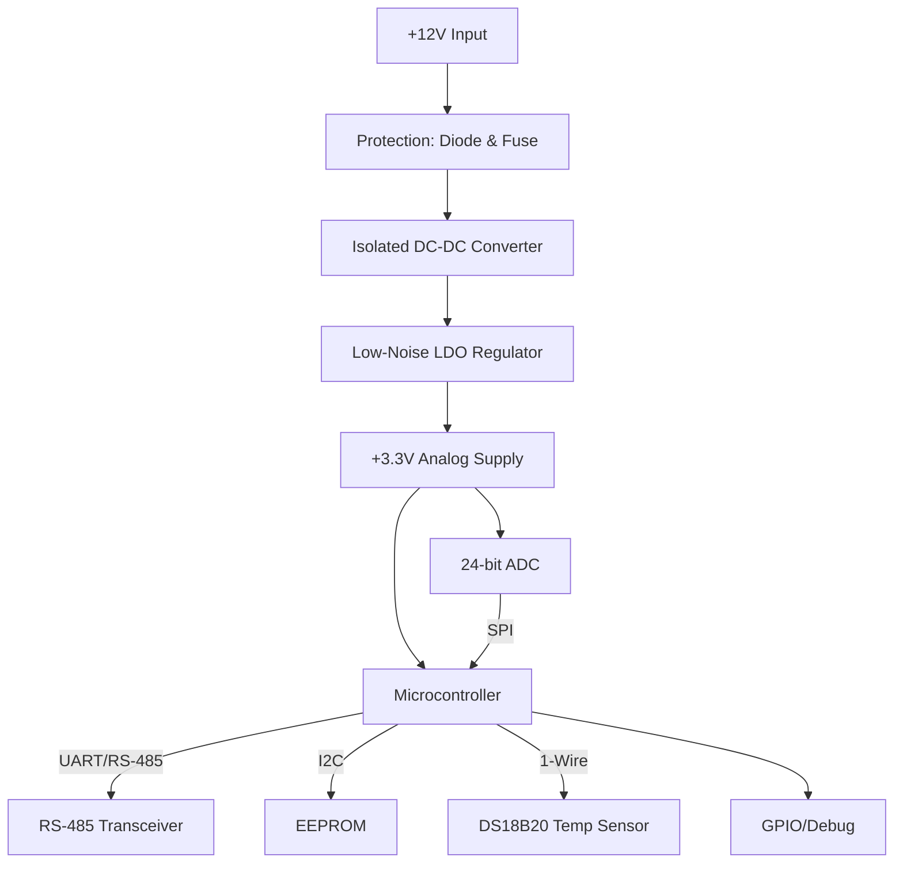

<!-- PROJECT LOGO -->

  

<h1 align="center">ISE-to-Modbus-RTU-Converter</h1>

  <b>Precision Analog Front-End & Industrial Modbus RTU Converter</b> 
  <i>Robust, Isolated, and Noise-Immune Hardware for Scientific & Industrial Sensing</i>

---

  
  
  

---

## 🚀 Overview

The **ISE-to-Modbus-RTU-Converter** is a state-of-the-art embedded hardware platform designed for high-precision analog signal acquisition and robust digital communication in industrial and scientific environments. It features a multi-stage, isolated power supply, a 24-bit high-resolution ADC, and a powerful microcontroller for seamless Modbus RTU communication. This converter is ideal for interfacing with pH (ISE) sensors, gas sensors, biomedical instrumentation, and other applications requiring accurate, low-level signal acquisition and reliable industrial communication.

---

## 🎯 Project Objectives

The primary goal is to deliver a robust, electrically isolated, and noise-immune analog front-end that ensures:
- **Accurate low-level signal acquisition**
- **Reliable, standards-compliant Modbus RTU communication**
- **Electrical safety and EMI immunity**
- **Easy integration with PLCs, SCADA, and industrial controllers**

---

## ⚙️ Features

- **Multi-stage Isolated Power Supply**: +12V input, isolated DC-DC, low-noise LDO for analog and digital domains
- **High-Resolution ADC**: 24-bit, differential input, programmable gain, internal/external reference
- **Industrial Microcontroller**: 32-bit, low-power, with SPI, I2C, UART/RS-485, GPIO
- **Modbus RTU Communication**: Hardware RS-485 transceiver, direction control, robust protocol stack
- **Peripheral Support**: I2C EEPROM, 1-Wire temperature sensor, test points, debug header
- **4-Layer PCB**: Optimized for EMI, thermal, and mechanical performance
- **Comprehensive Firmware**: Real-time data acquisition, Modbus stack, diagnostics

---

## 🏗️ System Architecture

---

## 🖥️ Schematic

  

---

## 📐 Hardware Design

### Power Supply
The power supply accepts a +12V input, protected by a diode and fuse, and feeds an isolated DC-DC converter. The +5V_ISO output is regulated to a low-noise +3.3V analog supply via an LDO. This architecture ensures galvanic isolation and minimal noise for sensitive analog measurements.

### Microcontroller
A low-power, 32-bit MCU (e.g., EFM32TG840F32) manages all digital interfaces, including SPI (for ADC), I2C (for EEPROM), UART/RS-485 (for Modbus), and GPIOs. The MCU is powered from the clean analog supply, maintaining a unified ground reference.

### ADC
The ADS124S08 (or similar) 24-bit ADC interfaces with differential analog sensors. It supports programmable gain, internal/external reference, and advanced filtering for high-accuracy measurements.

### Communication
An RS-485 transceiver with direction control enables robust Modbus RTU communication. I2C EEPROM provides non-volatile storage, and a DS18B20 1-Wire sensor monitors board temperature.

### Layout & Decoupling
All blocks are decoupled with high-frequency capacitors, with careful separation of analog and digital ground planes. EMI filters and ferrite beads are used to suppress noise and ensure signal integrity.

---

## 🗺️ Schematic

  

The schematic is organized into functional sections: power input/protection, regulation, microcontroller, analog front-end, ADC, and communication. Clear net naming and labeling facilitate easy signal tracing and debugging.

---

## 🧩 PCB Design & Stack-Up

This project uses a 4-layer PCB for optimal signal integrity and EMI performance:

- **Top Layer:** Components, high-speed and analog routing
- **Inner Layer 1 (GND):** Solid ground plane for shielding and return paths
- **Inner Layer 2 (Power):** Clean analog/digital power rails (+3.3V, +5V_ISO)
- **Bottom Layer:** Passives, low-priority signals, mechanical support

**Board Size:** 200mm × 16mm (optimized for DIN-rail or slim enclosures)

---

## 🖼️ PCB Visuals

### Top 3D View

  

This view shows the populated top side, including the MCU, ADC, protection, and filtering components. Placement is optimized for signal flow and manufacturability.

### Bottom 3D View

  

The bottom side contains SMD passives, vias, and traces, kept clean for soldering and signal routing.

### Top Layer

  

Main analog and digital signal routing, with careful clearance between domains.

### Inner Ground Layer

  

Solid copper pour for low-impedance return and shielding.

### Inner Power Layer

  

Dedicated to analog and digital power rails, minimizing voltage drop and noise.

### Bottom Layer

  

Routes non-critical signals, test points, debug, and low-priority GPIOs.

---

## 🧠 Firmware Overview

The firmware, developed in MCUXpresso IDE (or STM32CubeIDE), supports:
- SPI ADC configuration and data acquisition
- Real-time data processing and filtering
- Modbus RTU stack for RS-485 communication
- Diagnostics, error handling, and test point monitoring
- Flexible configuration for different sensor types and protocols

---

## 🛠️ Getting Started

1. **Power Up:** Connect a +12V supply to the input terminal.
2. **Programming:** Use the SWD header to flash the MCU with the provided firmware.
3. **Communication:** Connect RS-485 A/B lines to a Modbus master or PC (via USB-RS485 converter).
4. **Operation:** Use a terminal or GUI to send Modbus requests and read sensor data.
5. **Debugging:** Probe test points for ADC inputs and debug signals as needed.

---

## 📚 Documentation & Resources

- [Datasheet: ADS124S08 ADC](https://www.ti.com/product/ADS124S08)
- [MCU Reference Manual](https://www.silabs.com/documents/public/reference-manuals/efm32tg840f32.pdf)
- [Modbus RTU Protocol](https://modbus.org/docs/Modbus_over_serial_line_V1_02.pdf)
- [MCUXpresso IDE](https://www.nxp.com/design/software/development-software/mcuxpresso-software-and-tools/mcuxpresso-integrated-development-environment-ide:MCUXpresso-IDE)

---

## 📜 License

This project is licensed under the MIT License. You are free to use, modify, and distribute this design for commercial and non-commercial purposes, with proper attribution.

---

## 📬 Contact & Contributions

Contributions are welcome! Please fork the repository, submit issues, or open pull requests to improve the design. For questions, suggestions, or collaboration, contact the author via GitHub or email.

  
  

---

  <i>© 2025 ISE-to-Modbus-RTU-Converter. All rights reserved.</i>

